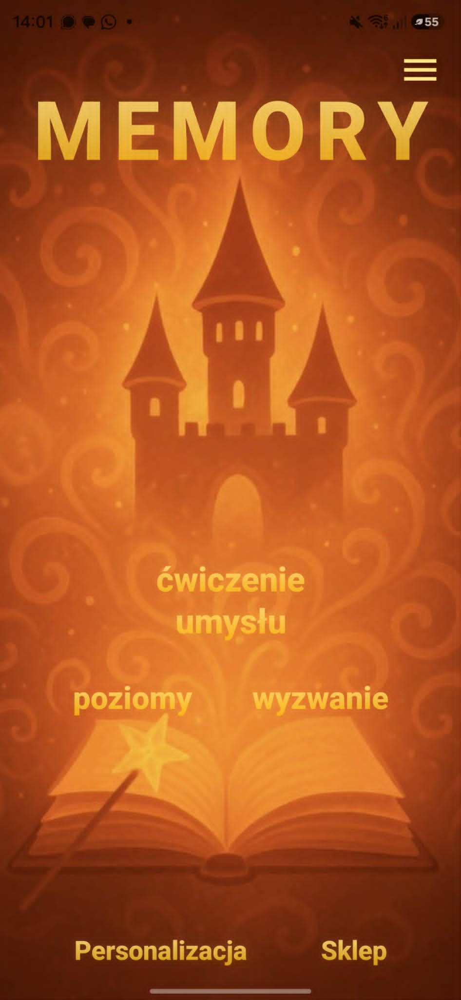
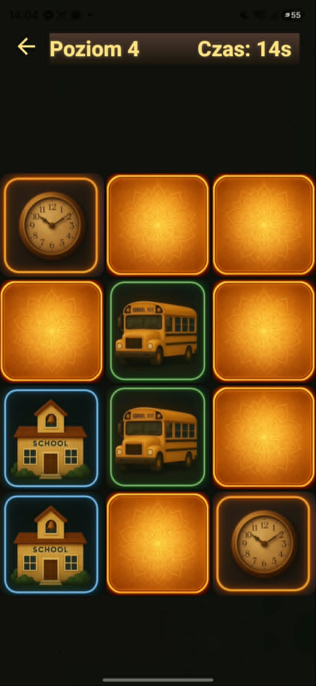
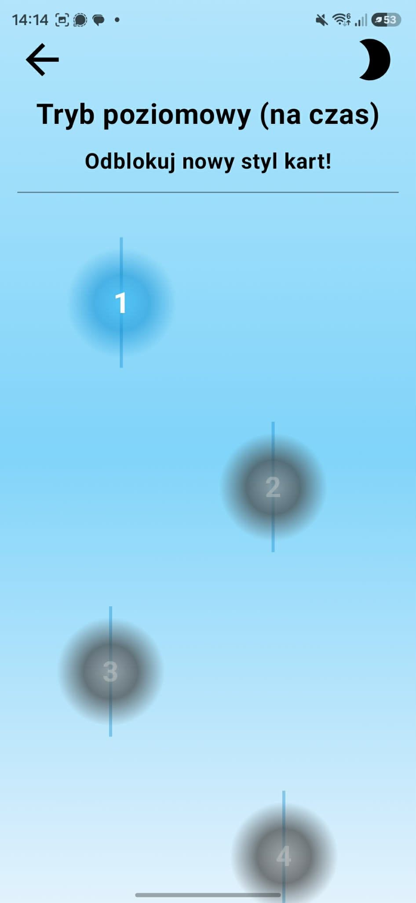
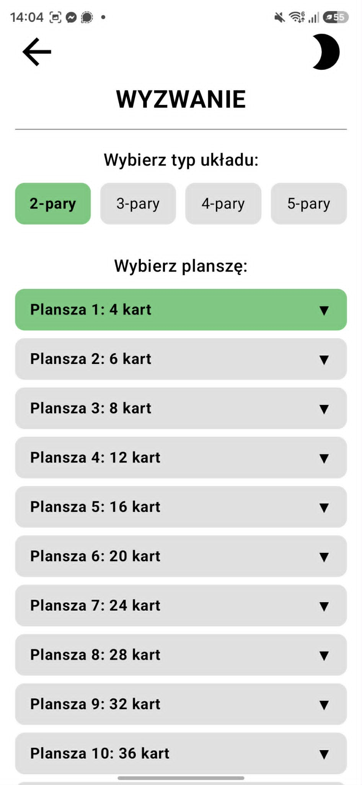
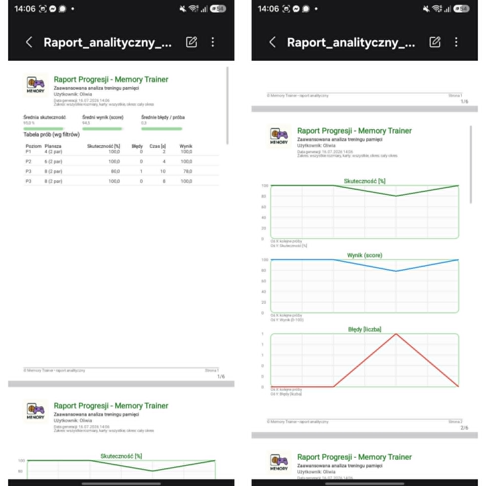
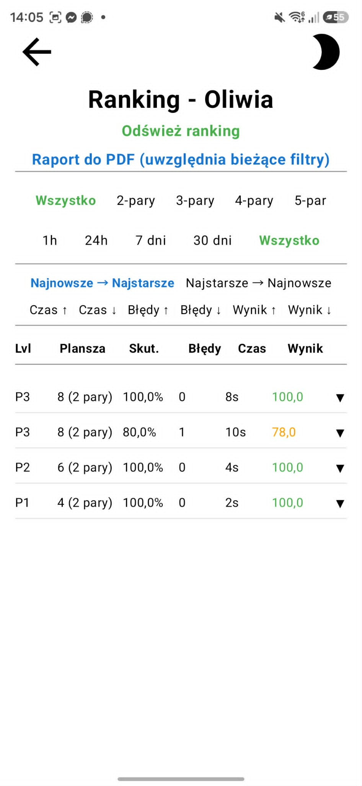
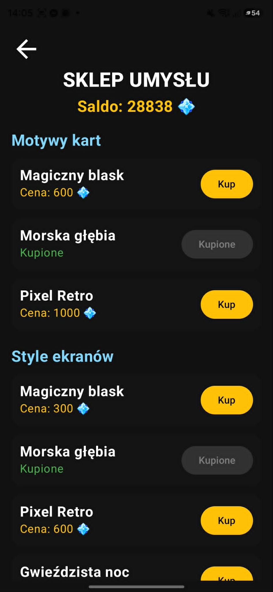
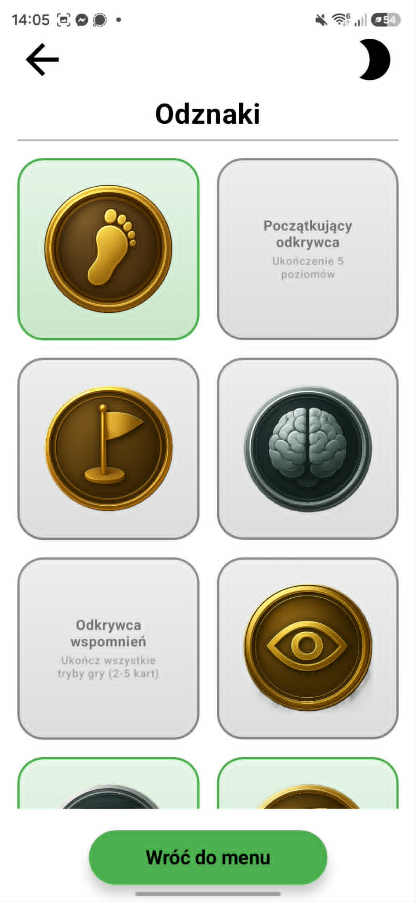

# Memory

## Intelligent Adaptive Cognitive Training Platform

Memory is an Android application that transforms a traditional memory game into an intelligent cognitive training platform.

Instead of offering predefined difficulty levels, the application analyses player behaviour, evaluates different categories of mistakes and dynamically adjusts future gameplay. The goal is to provide a personalized cognitive training experience rather than a static game.

The project was independently designed and developed from concept to a fully functional Android application in less than one month using AI-assisted development.

  

---

## Project at a Glance

| | |
|---|---|
| Development Time | Less than one month |
| Role | Sole Developer & Product Designer |
| Platform | Android |
| Technologies | Kotlin, Jetpack Compose |
| Development Approach | AI-assisted Development |
| Documentation | 75-page Engineering Thesis |

---

## The Idea

Traditional memory games provide exactly the same experience to every player.

Memory was designed to solve this problem by introducing adaptive cognitive training.

Instead of simply checking whether a player completes a level, the application analyses how the player performs, identifies behavioural patterns and continuously adjusts future gameplay to maintain an appropriate level of challenge.

---

## Adaptive Cognitive Engine

The adaptive algorithm evaluates multiple variables during every game session, including:

- completion time,
- player effectiveness,
- gameplay strategy,
- board configuration,
- previous sessions,
- player progress,
- mistake frequency.

Based on these observations, the application automatically increases or decreases the difficulty level, creating a personalized training experience instead of following predefined levels.

---

## Behaviour Analysis

Memory does not treat every incorrect move as the same mistake.

The application distinguishes between:

- Cognitive mistakes
- Associative mistakes
- Spatial mistakes
- Attention mistakes

Additionally, the system recognises different playing strategies, preventing repeated card discovery from being incorrectly classified as an error. This results in more accurate player analysis and better adaptive decisions.

---

## Core Features

- Adaptive difficulty adjustment
- Behaviour analysis
- Cognitive mistake classification
- Three independent game modes
- Achievement system
- Ranking system
- Session history
- Statistics and filtering
- Automatic PDF reports
- In-app shop
- Unlockable themes
- Interface personalization
- Dark and Light mode
- Animated user interface
- Local player profile

---

## Game Modes

### Adaptive Mode

Difficulty is automatically adjusted according to the player's current performance.

### Timed Mode

Thirty-two predefined challenges completed under time pressure.

### Challenge Mode

Players can compare results across different board configurations and improve their performance.

---

## Reports & Statistics

Every completed session is stored and analysed.

The application records:

- score,
- completion time,
- effectiveness,
- selected game mode,
- board configuration,
- player progress,
- mistake categories.

Users can generate professional PDF reports summarizing their cognitive training history.

The ranking system allows users to compare previous sessions, filter results and analyse long-term performance.

---

## Personalization

To increase long-term engagement, the application includes an integrated reward system with unlockable visual content.

Players can unlock:

- card themes,
- interface themes,
- profile customization,
- achievements.

---

## Technologies

| Category | Technologies |
|-----------|--------------|
| Mobile Development | Kotlin, Android Studio, Jetpack Compose |
| UI | Material Design |
| Features | Adaptive Algorithm, Local Storage, PDF Generation, Ranking System |
| Tools | Git, GitHub, AI-assisted Development |

---

## My Contribution

This project was designed and implemented entirely by me.

Responsibilities included:

- Product concept
- UX/UI design
- Android development
- Application architecture
- Adaptive algorithm design
- Gameplay logic
- Behaviour analysis
- Gamification system
- Ranking system
- PDF generation
- Testing
- AI-assisted iterative development

---

## Project Scale

- Complete Android application
- Developed independently in less than one month
- Three gameplay modes
- Thirty-two timed challenges
- Twenty-four achievements
- Adaptive cognitive engine
- Dynamic difficulty adjustment
- Four categories of player mistakes
- Ranking and statistics system
- Automatic PDF reports
- In-app shop
- Interface personalization
- 75-page engineering thesis

---

## Future Improvements

Potential future extensions include:

- Cloud synchronization
- AI-powered cognitive recommendations
- User authentication
- Online leaderboards
- Wear OS support

---

## Documentation

The complete project is documented in a **75-page engineering thesis**, covering:

- application architecture,
- adaptive algorithm design,
- UX/UI decisions,
- behavioural analysis,
- implementation details,
- testing process,
- future development.

📄 **Full documentation:**

[Memory – Engineering Thesis (PDF)](docs/Memory_Engineering_Thesis.pdf)

---

## Contact

**Oliwia Wojdalska**

GitHub: https://github.com/Oliwkakpkolix

Email: owojdalska@gmail.com
